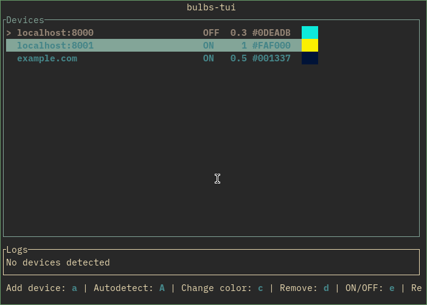

## bulbs-tui

TUI application for [bulbs](https://github.com/imjah/bulbs) written in rust using [ratatui](https://ratatui.rs/) and [ureq](https://github.com/algesten/ureq).



It's also possible to use it in non interactive mode:
```
$ bulbs-tui cli --help
Control bulbs non interactively

Usage: bulbs-tui cli [OPTIONS] [POWER]

Arguments:
  [POWER]  Set LED power [possible values: on, off, toggle]

Options:
  -a <ADDR>       Device address (can be specified mulitiple times)
  -b <NUM>        Set brightness
  -d              Automatically find devices
  -c <COLOR>      Set color
  -s              Show status
  -h, --help      Print help
```
